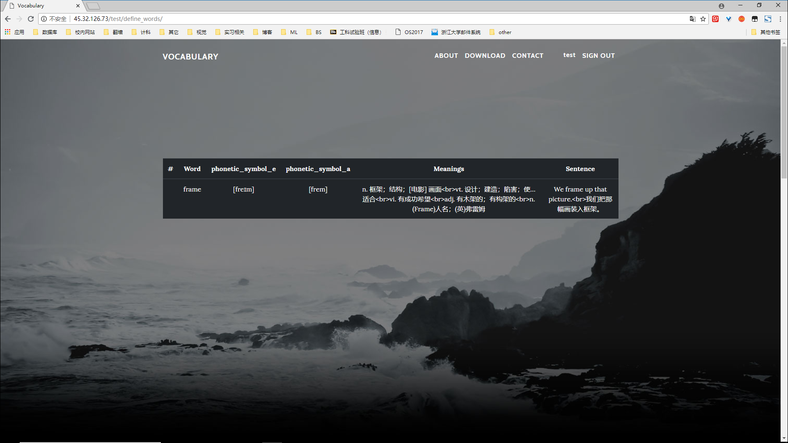

# vocabulary 

[TOC]

## 简介 

vocabulary是一个背单词网站，支持用户注册、登录、登出，支持背诵单词、复习和考核，用户可以根据自己喜好选择单词书和每天个人背诵和复习计划，也可以设置考试题目，还可以查看自己收藏的单词

## 地址

本网站已经部署到远端服务器：[vocabulary](http://45.32.126.73/) ，可以点击进入

## 网站操作说明

在界面上本网站已做了响应式，可适应PC和移动端，这里以PC端为例进行说明。

### 首页

网站首页界面如下：

* 用户点击导航栏中左上角VOCABULARY按钮可回到顶部页面

* 可在导航栏右上角中选择注册或是登录

###注册
注册界面如下：

* 密码长度必须大于等于6个字符
* 邮箱地址必须符合规范

###登录
登录界面如下：

输入正确的用户名密码后即可进入用户主页界面

### 用户首页

* 图中为用户首页，用户可以选择背单词、复习、考核、查看自定义单词和管理单词
* 注意：如果是新用户，需要首先在管理单词界面选择一本单词书之后才能开始背诵或是复习单词

### 管理单词

* 图中包含用户的单词计划（背诵、复习和考试）以及单词书的管理和选择，图中也会显示用户的单词背诵进度
* 在计划部分，用户直接修改输入框对应内容后点击*change* 按钮即可
* 单词书部分，用户直接选择单词书下的按钮后点击*change* 按钮即可更改

### 背诵单词

* 用户可以点击音标旁的播放按钮听单词的英式或是美式发音
* 用户需要点击底部的按钮之后才能查看单词的含义和例句

### 收藏单词

* 在背诵单词时，用户点击右上角星号即可收藏单词

### 完成背诵

* 完成背诵后，用户可以选择再背一组单词或是回到主界面

### 复习

### 完成复习

* 完成复习后，用户可以选择继续复习或是货到主界面

### 考试

* 在考试时，用户不可查看单词含义，只能选择是否知道这个单词
* 点击*Submit* 按钮后提交试卷

### 完成考试

* 完成考试后，用户可以选择继续考试或是回到主界面
* 用户也可以选择回顾上次的考试，此时可以查看单词的详细内容

### 查看自定义单词

* 此界面允许用户查看当前已经收藏的单词

## 其它
* 如果您对网站有其它的建议和评价，欢迎联系我的 [Github](https://github.com/BgmLover/vocabulary) 账号